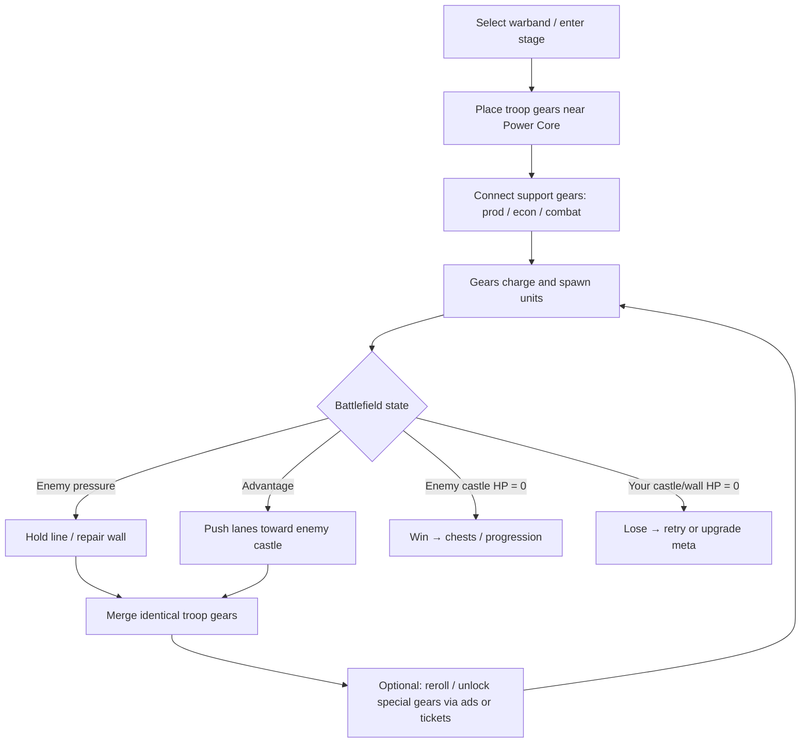
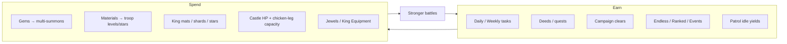

# Core Gameplay Loop

**Confidence:** High for loop structure (store + guides); Medium for exact timers/HP formulas (not publicly tabulated)

---

## One-sentence loop

Build a connected gear network around the Power Core → spawn troops into a push/hold battle → win by destroying the enemy castle (or surviving pressure) → spend rewards into warband, castle, kings, and summons → return with stronger tools.

---

## Session loop (in-battle)

### Player decisions each run

1. **Warband selection** — Which 2–4 troops to bring (community strongly favors focus).  
2. **Opening placement** — Which troop gears attach first to the Power Core; early spawn tempo matters.  
3. **Merge discipline** — Merge duplicates to raise tier/quality rather than flooding weak spawns.  
4. **Support gear priority** — Economy (Coin Bag / Fountain) vs production (Accelerator / 1.5x / Nitro / Speed) vs sustain (Repair / Shield / Spring) vs amplify (Mirror / Level-up / Morale).  
5. **Offense vs defense bias** — Accelerator/offensive setups vs Repair-heavy late-stage defense.

### Win / lose conditions

| Outcome | Condition (public understanding) | Confidence |
|---------|----------------------------------|------------|
| **Win** | Reduce enemy castle HP to zero (push units through) | High — core fantasy in store + guides |
| **Lose** | Player castle / wall HP reaches zero | High — Repair gear, wall upgrades, review complaints about wall damage |
| **Soft fail (Endless)** | Run ends when defense collapses; wave/score determines rewards | High — Endless discussions; daily reward thresholds (e.g. wave 50 mentions in reviews) |

Exact HP values, lane counts, and damage formulas: **unknown from public docs** — need playtesting.

---

## Meta progression loop (out-of-battle)

### Soft gates players feel

- **Chicken-leg capacity** — Limits concurrent summoned troops; expanded via castle upgrades (Clashiverse).  
- **Material focus** — Spreading upgrades across many troops stalls progress (guides + Reddit).  
- **Gacha RNG + guarantees** — Materials more common than full units; 10-draw troop guarantee, 100-draw Epic (Clashiverse).  
- **Difficulty spikes** — Late Normal / Elite / Nightmare and piercing enemy packs (store reviews + Reddit).  
- **Ad-gated mid-run power** — Special gears, repairs, speed boosts often behind ads (player reviews).

---

## Session vs meta: design tension

| Layer | Skill / agency | Pay / grind pressure |
|-------|----------------|----------------------|
| Session | Placement topology, merge timing, gear pick order | Ad rerolls, VIP speed (Endless 5x for VIP/SVIP per patch notes) |
| Meta | Warband focus, king leveling priorities | Gems, Glory/Standard/Advanced Pass, SVIP, troop packs |

The game’s retention engine is the **tight coupling** between board mastery (feels skillful) and vertical stats (feels collectible). Players who only grind without learning Mirror + merge patterns still stall; players who only place well without leveling eventually hit HP walls.

---

## Sources

- Store pitch: Power Core placement, spawn fantasy, 100+ levels — App Store / Google Play.  
- Chicken legs, gems, gacha guarantees — [Clashiverse beginner guide](https://clashiverse.com/gear-defenders-beginner-guide/).  
- Focused warband / Paladin+Ninja setups — r/GearDefenders “Strong unit setups”, “Beginner's Guide”, “Warband/Gear/King advice”.  
- Endless average troop level scaling — Reddit king/warband advice thread.  
- VIP 5x Endless, season Endless, Ranked Trials — App Store / APK “What’s new” notes.
