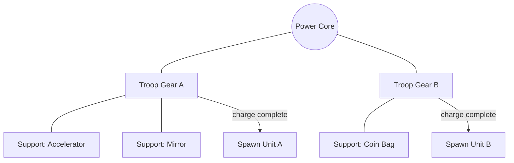

# Battlefield and Power Core

**Confidence:** High for conceptual model; Medium for board geometry details; Low for numeric spawn rates

---

## Battlefield fantasy

Combat plays out as a **lane / push battlefield** between two fortresses:

- **Your side:** Castle / wall HP you must protect.  
- **Enemy side:** Castle HP you must reduce to win.  
- **Units:** Spawned from your gear network; they move, fight, and apply roles (tank, pierce, AoE, CC, cavalry dive).

Store copy emphasizes varied battlefield shapes (“narrow canyons to sprawling plains”) and faction-specific attack patterns (goblins, mummies, yetis). Exact map templates and lane counts are **not documented publicly**.

---

## Power Core

**Role:** Central battery / hub of the placement puzzle.

Confirmed behavior (marketing + guides):

1. Place **soldier (troop) gears** around the Power Core.  
2. Connected gears **continuously charge** and **spawn combat units**.  
3. Connectivity matters: productive gears with more connections / better adjacency generate faster summon progress (Clashiverse).  
4. Players can **reposition gears after placement** to optimize connections (Clashiverse).

### Design intent (analysis)

The Power Core turns “army building” into a **spatial graph problem**: distance from hub, branching, and which gears share production buffs create emergent tempo. This is the game’s primary in-session skill ceiling.

---

## Chicken legs (summon capacity)

| Fact | Detail | Source / confidence |
|------|--------|---------------------|
| Starting capacity | ~**10** chicken legs | Clashiverse — High |
| Cost | Each summoned troop consumes **1** chicken leg | Clashiverse — High |
| Expansion | Upgrade **castle level / HP** to unlock more legs | Clashiverse — High |
| Design function | Hard cap on field presence; prevents infinite spawn dominance | Inferred |

**Note:** Some players/guides casually call chicken legs “energy.” Public beginner guidance treats them as **summon slots / concurrent capacity**, not a regenerating stamina bar. Whether any secondary stamina system exists is **unknown**.

---

## Castle / wall HP

- Player fortress has HP that enemies can damage; reaching zero loses the run.  
- **Repair** support gear (and ad-based tower repair mentioned in reviews) restores sustain mid-fight.  
- Patch history: **Wall system fully upgraded** (v1.4.x notes); later **Wall Decorations** (cosmetic/progression layer).  
- Community: late campaign often requires Repair; Endless players hunt Repair in gear rolls.

Exact base HP curves, upgrade costs, and damage mitigation formulas: **unknown**.

---

## Summon cadence

Observed principles (community + guides):

- Each troop gear has its own **production / charge speed**.  
- **Speed / Accelerator / 1.5x / Nitro** gears modify connected production.  
- Stacking multiple production multipliers can yield **non-intuitive / super-linear** results (players report math that does not match naive 1.5×1.5 expectations).  
- Accelerator may have a **wave-based charge-up**; 1.5x Boost is described as immediately available and slightly stronger overall by some players, while Accelerator can be cheaper earlier.  
- Merging reduces clutter and improves effective spawn quality (fewer weak spawns stealing chicken legs).

Exact charge seconds per gear tier: **unknown**.

---

## Board construction tips (community-confirmed practices)

1. Build high-value connected clusters near the core first.  
2. Prioritize merge of identical troop gears.  
3. Connect production multipliers to your carry troop (often Paladin).  
4. Mirror on carry spawns for “virtual second copy” tempo (Reddit: Mirror ≈ near-double Paladin presence with charge nuances).  
5. Add Repair when enemy DPS threatens wall breakthroughs.  
6. Leave room for late special gears; locking too many rolls early can starve Repair (Endless advice).

---

## Unknowns requiring playtest

- Grid size, adjacency rules, maximum gear count.  
- Whether connections are orthogonal-only or include diagonals.  
- Exact interaction of “Link” gear (mentioned on Reddit) vs Accelerator.  
- Lane AI targeting and piercing-shot physics (major balance complaint in reviews).

---

## Sources

- Power Core placement fantasy — App Store / Google Play.  
- Chicken legs, merge, connection productivity — [Clashiverse](https://clashiverse.com/gear-defenders-beginner-guide/).  
- Accelerator vs 1.5x behavior — r/GearDefenders “How do 1.5x Boost and Accelerator work…”.  
- Placement advice screenshots / build order — r/GearDefenders “Need help”, “Strong unit setups”.  
- Wall system patch notes — App Store / APK changelogs.
