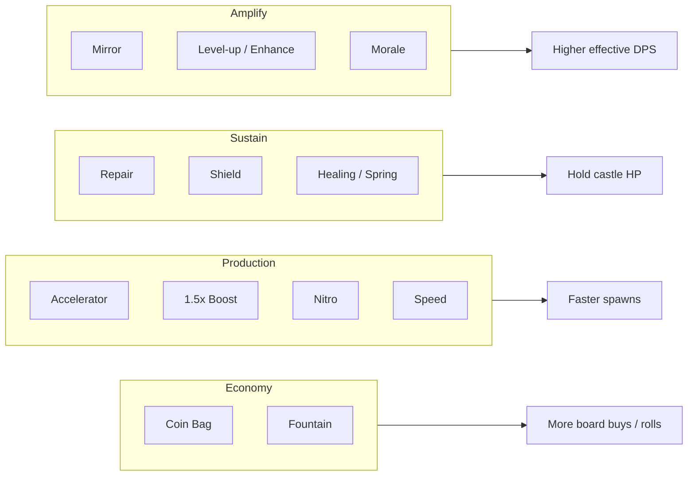

# Gear System (Support Gears)

**Confidence:** Medium–High for names & qualitative roles (community); Low for exact numeric values and full official catalog

---

## Two gear families

| Family | Function | Player verb |
|--------|----------|-------------|
| **Troop gears** | Represent units in your warband; charge → spawn that troop | Place, merge, connect to Core |
| **Support / skill / hero gears** | Modify production, economy, sustain, or amplify spawns | Place adjacent / connected; sometimes unlock via rolls/ads |

This document catalogs **support gears** as named by community and beginner guidance. Official in-game tooltips were not available for citation.

---

## Support gear catalog (community)

| Gear | Category | Reported effect / use | Confidence |
|------|----------|----------------------|------------|
| **Mirror** | Amplify | Copies/mirrors a connected troop’s spawn — “OP”; ≈ second Paladin with charge-rate nuances | High consensus |
| **Repair** | Sustain | Restores castle/wall HP; mandatory late campaign / Endless | High |
| **Coin Bag** | Economy | Generates in-run currency; scales with gear level; common staple | High |
| **Fountain / Spring** | Economy / sustain hybrid | Alternative to Coin Bag or healing; Spring preferred outside Endless by some | Medium |
| **Accelerator** | Production | Speeds connected gears; may ramp with waves; strong early value | High |
| **1.5x Boost** | Production | Flat production multiplier; strong late; cheap relative value at high levels | High |
| **Nitro** | Production | Alternate speed gear; situational swap for 1.5x | Medium |
| **Speed** (generic speed gears) | Production / mobility support | Prioritized with cavalry strategies; “gear 8 speed” build goals mentioned | Medium |
| **Level-up / Upgrade / Enhance** | Amplify | Levels/enhances connected troops mid-run | High (naming varies) |
| **Morale** | Amplify | Troop buff; especially recommended for **Endless** | High |
| **Shield** | Combat buff | Free-hit / shield buffer on troops; pairs with speed/cavalry | Medium–High |
| **Link** | Production graph | Mentioned in advanced buff setups (with 1.5x, enhance, morale) | Medium — exact rules unclear |
| **Healing** (vs Spring) | Sustain | Direct heal option; Spring sometimes preferred outside Endless | Medium |
| **Wall gears** | Defense | Players report running multiple wall gears in Endless | Low–Medium |

**Not confirmed as exhaustive.** Patch notes historically added “Hero Gears and Skill Gears” (v1.1.x); later systems (King Equipment / Jewels) are separate meta items, not board gears.

---

## Economy vs combat gears

### Typical loadouts (community)

| Profile | Gears | When |
|---------|-------|------|
| **Beginner** | Mirror, Level-up, Morale, Repair **or** Accelerator | Learning curve |
| **Optimal special set** | Mirror, Level-up, Coin Bag, 1.5x | Standard strong run |
| **Defensive late** | Swap/add **Repair**; Shield as needed | Wall pressure stages |
| **Endless** | Include **Morale**; prioritize finding **Repair** in rolls | Long wave survival |
| **Player staple example** | Coin Bag + Accelerator/1.5x + Repair + Morale/Upgrade | Reddit mid players |

---

## Placement synergy

1. **Attach Mirror to your carry troop gear** (usually Paladin) so duplicated spawns matter.  
2. **Pipe production multipliers** into the same carry cluster; stacking multiple multipliers is intentionally powerful (community experiments).  
3. **Coin Bag** funds further placements — higher gear level → better economy (player reports).  
4. **Repair** is reactive insurance; Endless players often **avoid locking rolls** until Repair appears.  
5. Repositioning after placement is encouraged to retune connections (Clashiverse).

### Accelerator vs 1.5x (community research)

- Both claim ~+50% connected production in descriptions, but measured results differ.  
- Players observe **non-multiplicative stacking** (additive-ish or capped interactions; exact formula disputed).  
- Accelerator may ignore a “50% cap” on its base component (one explanation on Reddit).  
- Practical advice: Accelerator better/cheaper early; 1.5x preferred later for cost/efficiency.

Treat all percentages above as **player-observed**, not official.

---

## Design analysis (brief)

Support gears are the **run-defining RNG + skill layer**: like roguelike relics attached to a merge board. Mirror creates snowball identity; Repair creates a tension between greed (production/economy) and survival. Monetization intersects here via **ad rerolls** and skip tickets — a retention risk when ads are long (store reviews).

---

## Sources

- r/GearDefenders: Strong unit setups; Warband/Gear/King advice; Endless Mode; Accelerator math threads; stacking speed multipliers  
- [Clashiverse](https://clashiverse.com/gear-defenders-beginner-guide/) — speed/shield gear advice, merge, connections  
- App Store reviews — ad-gated repair / special gears  
- Patch notes — Hero/Skill gears introduction
