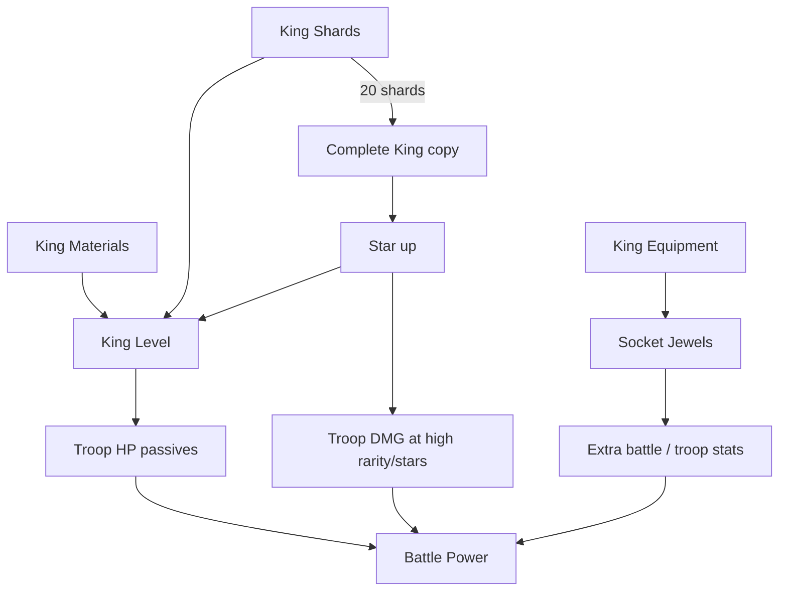

# Kings and Progression

**Confidence:** Medium–High for qualitative king effects & upgrade structure; Low for complete king roster stats

---

## What Kings are

Kings are a **meta progression layer** introduced mid-lifecycle (first King: **Lionheart Richard** per v1.2.7 notes). They do not replace the gear board; they **feed global passives into troops** and unlock further systems (equipment, jewels, Live2D presentation, events).

---

## How Kings feed battle power

Community consensus (r/GearDefenders warband advice):

| Lever | Effect on troops | Notes |
|-------|------------------|-------|
| **Level / star any King** | Bonus **HP** to troops | “Don’t hesitate to level and star them all” |
| **Higher rarity + higher stars** | Bonus **damage** to deployed troops | Damage gated behind rating/stars more than raw level |
| **Level milestones (~30 cited)** | Unlock additional **passive bonuses** | Exact passive list unknown |
| **King Equipment + Jewels** | Socketed boosts to battle & troop stats; Mythic Jewels may boost troop skills | Patch notes v1.5.x |
| **Active King fantasy** | Named mythic/ultra-rare Kings (Thor, Poseidon, etc.) as collection goals | Event/gacha tied |

---

## Upgrade resource rules (community-documented)

From r/GearDefenders “King Upgrade materials” (player explanation):

1. **King materials** required to level.  
2. **King shards** required every **5th level** (example thresholds discussed: 5/10/15 pattern — exact table not fully published).  
3. Every **10 levels**, advancement requires **increasing star level**.  
4. Star-ups consume **full Kings**, which can be crafted from **20 shards**.

Treat shard counts as **community-reported**, not datamined.

---

## Known / named Kings (from patch notes & community)

| King | Notes | Source confidence |
|------|-------|-------------------|
| **Lionheart Richard** | First King | Patch 1.2.7 — High |
| **Thor** | Ultra Rare; Forge Festival | Patch ~1.5.2–1.5.4 — High |
| **Julia** | Added to King Pool | Patch 1.5.5 — High |
| **Balder** | Added to King Pool | Patch 1.5.5 — High |
| **Poseidon** | Mythic King; Summer Bash era | Patch ~1.5.12–1.5.14 — High |
| Additional unnamed Kings | “4 Kings join” in Easter 1.3.8 notes | Partial |

Full kit descriptions (active skills vs pure aura) for each King: **largely unknown publicly**.

---

## Adjacent progression systems

### Troops (see `03-troop-system.md`)

Levels, stars, materials, warband focus — primary DPS/HP curve.

### Castle

HP upgrades + **chicken-leg capacity** — sustain and field size.

### Wall

Upgraded wall gameplay + decorations — defense and cosmetics/progression sink.

### Jewels & King Equipment (v1.5+)

- Equip exclusive gear on King; socket Jewels.  
- Jewel Draw added to Summon.  
- Combine **3 Epic → 1 Mythic Jewel**; Mythic traits may boost troop skills.  
- Ranked Trials / Ranked Match reward King Equipment & rare Jewels/Gems.  
- Jewel Shop / Refinement Stones (batch exchange) — economy sink.

### Patrol

Idle/offline-style yields; patch notes added **King growth resources** to Patrol.

### Summon Exchange currency

Summons grant currency redeemable in Exchange Shop (1.5.5 notes).

---

## Endless coupling

Endless Mode strength scales with **average level of your troops** (community). Therefore King HP/DMG passives and broad troop leveling both matter: specializing one troop helps campaign; **raising the roster average** helps Endless.

---

## Design read

Kings convert **collection events** into **account-wide power**, a standard midcore pattern. The HP-for-everyone vs DMG-for-high-investment split encourages both breadth (level many kings) and whale/vertical chase (high-star rare kings). Equipment + Jewels add a second gacha axis on top of troop summons — power creep risk if not carefully gated.

---

## Sources

- App Store / APK changelogs (1.2.7–1.5.14)  
- r/GearDefenders: King Upgrade materials; Warband/Gear/King advice  
- Clashiverse — troop starring parallel
