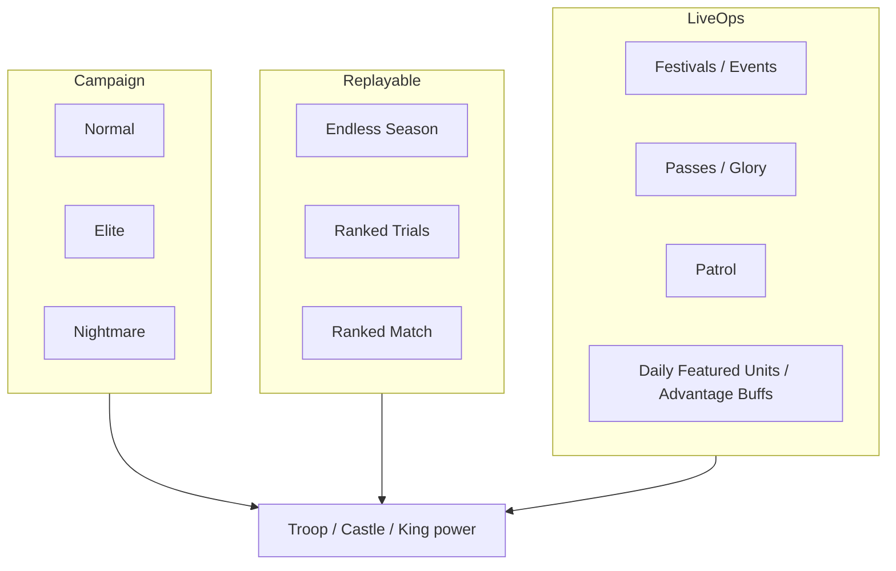

# Modes and Content

**Confidence:** High for mode existence (patch notes/stores); Medium for rules details; Low for exact level counts per chapter

---

## Content map

---

## Campaign / Main Story

| Aspect | Public info | Confidence |
|--------|-------------|------------|
| Scale | **100+** meticulously designed levels (store) | High |
| Fantasy factions | Goblins, mummies, yetis (store); later chapters expand | High |
| Named later chapters | **Underwater World**; **Pirate Ship** | High (patch notes) |
| Difficulties | **Normal / Elite / Nightmare** tracked by players | Medium–High (community progress posts) |
| Resume | Main Story Battle Resume after interruptions | High (v1.3.6) |
| Replay | Cleared levels can be replayed; Daily Advantage Buffs refreshable | High (v1.5.6–1.5.7 notes) |

Player reports cite progress deep into 100+ on Normal and high 100s on Elite/Nightmare — exact chapter structure undocumented.

Bosses: late stages durable, sometimes paired (Clashiverse). Piercing ranged enemies (e.g. “cactus” needle packs) called out as painful in reviews.

---

## Endless Mode

| Feature | Detail | Source |
|---------|--------|--------|
| Purpose | Wave survival / high-score style challenge; daily rewards | Reviews + patch notes |
| Scaling | Uses **average troop level** to scale strength | Reddit — High |
| Season system | Endless Challenge → Season with **Battle Pass** & **King Fragments** | v1.3.8 notes |
| QoL | Resume function; start from later waves based on best record | v1.2.x / v1.5.6–7 |
| Speed | VIP/SVIP can enable **5x** battle speed in Endless | v1.5.6–7 |
| Gear RNG | Mid-run gear rolls; Repair highly contested; ad rerolls | Community Endless threads |
| Bugs | Occasional illegal-lane enemy spawns ending runs (App Store review) | Anecdotal |

Design function: infinite treadmill for daily login + pass XP + king shards, independent of campaign clear state.

---

## Ranked content

| Mode | Rewards / notes | Patch era |
|------|-----------------|-----------|
| **Ranked Trials** | Climb for King Equipment & rare Jewels; trials added over time; battles shortened for pace | 1.5.0+ |
| **Ranked Match** | Rankings; King Equipment & Rare Gems | ~1.5.2–1.5.4 |

Exact competitive ruleset (async defense? PvE leaderboard?) is **not clearly documented** in public text — needs playtest.

---

## Live-ops & side systems

| System | Role |
|--------|------|
| **Daily Featured Units / Daily Advantage Buffs** | Rotating strategic modifiers |
| **Patrol** | Idle yields; includes King growth resources |
| **Monster Codex** | Track battles / collection binder |
| **Treasure Hunt + Sticker Collection** | Periodic event loops |
| **Adventure Journey** | Festival-tied mode (v1.2.7) |
| **Wall Decorations** | Personalization / sink |
| **Nicknames, avatars, frames** | Social identity |
| **Battle DMG Stats** | Post-battle troop damage transparency |
| **Festivals** | Easter, Forge Festival (Thor), Battle Festival, Artisan Fest (Precision Workshop / Mechanical Chests), Summer Bash (Poseidon) |

---

## Passes & premium tracks (mode-adjacent)

Seen on store IAP lists / notes:

- Standard Pass (~$9.99)  
- Advanced Pass (~$14.99)  
- **Glory Pass** (~$19.99)  
- Endless Season Battle Pass (feature notes)  
- Ranked Trials pass purchase improvements  

Exact reward tracks: **unknown** without in-client capture.

---

## Sources

- App Store / Google Play feature copy  
- App Store & APK “What’s new” 1.1.x–1.5.14  
- Clashiverse late-game / boss notes  
- r/GearDefenders Endless & beginner progress threads  
- App Store user reviews (Endless bugs, ad repair)
