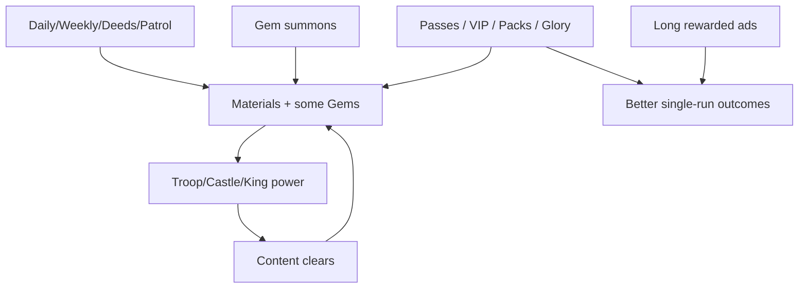

# Economy and Monetization

**Confidence:** High for IAP names/prices & ad presence; Medium for soft-currency sinks; Low for exact pack contents & pity beyond published guarantees

---

## Currency & resource layers

| Resource | Type | Primary sinks | Earn (F2P) |
|----------|------|---------------|------------|
| **Gems / Diamonds** | Hard-ish premium | Multi-summons, some upgrades, revives | Daily/weekly tasks, deeds, events; IAP packs |
| **Troop materials / cards** | Soft progression | Level & star troops | Summons, chests, achievements |
| **Castle upgrade tokens** | Soft | Castle HP + chicken legs | Win chests |
| **Gear tickets** | Soft | Gear-related unlocks (details sparse) | Chests |
| **King materials / shards** | Soft / rare | King levels & stars | Events, Patrol, Endless season, fragments |
| **Jewels / Refinement Stones** | Mid soft-premium | King Equipment sockets; Epic→Mythic craft | Jewel Draw, Ranked, Jewel Shop |
| **Summon exchange currency** | Soft | Exchange Shop rewards | Summoning |
| **Ad skip tickets** | Convenience | Skip ads on Nightmare / key moments | Unknown earn rate; community values them |

Clashiverse highlights: **5th weekly chest ≈ 300 free gems** as a key F2P target.

In-run: **Coin Bag / Fountain** produce battle-local currency for placements (distinct from meta gems).

---

## Gacha / summons

| Rule | Detail | Confidence |
|------|--------|------------|
| Rates (cited) | Rare 64% / Epic 32% / Legendary 4% | Medium–High (Clashiverse) |
| Reality check | Many pulls are **materials**, not full new troops | High |
| Pity / guarantee | **Every 10 draws → guaranteed troop**; **100 draws → guaranteed Epic** | High (Clashiverse) |
| Advice | Save for **10 / 100 multi-summons**; avoid impulsive single spends | Guide consensus |
| Extra axes | Jewel Draw on Summon; festival king targets (Thor, Poseidon) | High |

Google Play labels **“In-Game Purchases (Includes Random Items)”** — regulatory disclosure for gacha.

---

## IAP catalog (iOS public list; USD)

Snapshot from App Store / App Pricing Lab (prices may vary by region/time):

| Product (store name) | Approx. price | Likely role |
|----------------------|---------------|-------------|
| Standard Pack 1 | $0.99 | Entry pack |
| Standard Pack 2 | $4.99 | Mid pack |
| Standard Pack 4 | $9.99 | Larger pack |
| Diamonds_02 | $4.99 | Gem pack |
| VIP | $3.99–$4.99 | Convenience / buffs (duration complaints) |
| SVIP | $9.99 | Higher VIP; Endless **5x speed** entitlement (notes) |
| Standard Pass | $9.99 | Battle pass tier |
| Advanced Pass | $14.99 | Higher pass |
| **Glory Pass** | **$19.99** | Premium pass track |
| weekly_troop_3 / daily packs | ~$9.99 | Troop-targeted offers |
| Regional bundles | Variable | Whale framing criticized in reviews (e.g. “$500→$50” style discounts) |

**Important player complaint:** Some VIP purchases allegedly did not clearly disclose **30-day duration** before buy (Google Play review) — trust risk.

---

## Ads as monetization

Ads are a major revenue & friction layer:

| Ad use (player-reported) | Design effect |
|--------------------------|---------------|
| 1.5x game speed (~15 min) | Grind acceleration |
| Repair tower / wall | Mid-run sustain gate |
| Reroll / unlock special gears | Run quality gate |
| Other bonuses | Optional per some reviews |

**Sentiment:** Gameplay praised; **ad length** (2–5 minutes cited) and frequency inside a single round are primary 1-star drivers. Developer responses acknowledge ad load as funding necessity.

VIP/SVIP and ad-skip tickets partially convert ad fatigue into IAP.

---

## Soft vs hard — designer view

- **Skill still matters** (board + merge + Mirror), so the game is not pure pay-to-win at early/mid.  
- **Late vertical walls** (Nightmare, Endless, Ranked) plus multi-currency upgrades create spend pressure.  
- Multiple parallel gachas (troops, kings, jewels) increase perceived incompleteness — classic midcore ARPU design.

---

## Sources

- [Clashiverse beginner guide](https://clashiverse.com/gear-defenders-beginner-guide/) — gems, rates, guarantees, weekly chest  
- App Store IAP list; [App Pricing Lab](https://apppricinglab.com/app/apple/6740892835)  
- Google Play reviews (VIP duration, ads)  
- App Store reviews (ads, passes, bundles)  
- Patch notes — VIP 5x Endless, Jewel systems, passes
